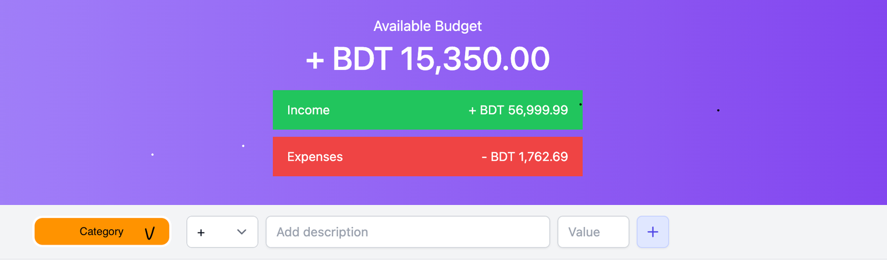
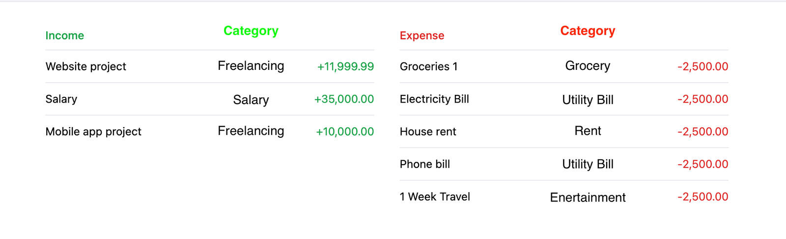

## Final Assignment

The files in this folder serve as the starting point for Final Assignment. Please review the instructions and use these materials to begin your assignment.

## Submission Guidelines

- Create a repository on your Github named `final-assignment`
- Copy the files of this folder and write your solution on top of it.
- Create a entry on the Google Sheet with the github repo link.

## Deliverables

- Add Category dropdown option in Transaction Entry row

- Add Category Column in Income/Expense List

